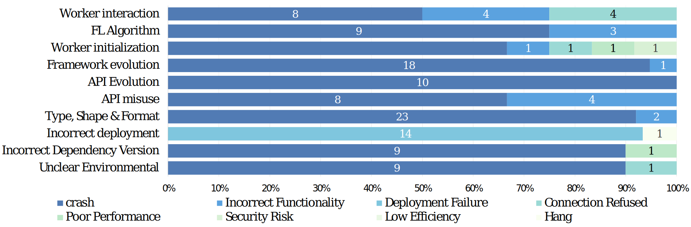

# Understanding the Bug Characteristics and Fix Strategies of Federated Learning Systems

This repository consists of three main folders: Dataset_Init, Manual_Labelling and Quantitative_study.

1. **Dataset_Init** folder: The list of initially mined Issues and Pull Rquests(after **Step 1**) for each framework from GitHub is presented in the file `GitHub_init/{frameworkname}/issues_init.csv` and `GitHub_init/{frameworkname}/PRs_init.csv`.

    Total data and data collection process of 6 federated learning frameworks (Data collection until October 1, 2021):
    <table>
        <tr>
            <th rowspan="2">Framework</th>
            <th colspan="5">
Total
</th>
            <th colspan="2">
Step1
</th>
            <th colspan="2">
Step2
</th>
            <th colspan="2">
Step3
</th>
        </tr>
        <tr>
            <td>
LOC
</td>
            <td>
Forks
</td>
            <td>
Stars
</td>
            <td>
Issues
</td>
            <td>
PRs
</td>
            <td>
Issues
</td>
            <td>
PRs
</td>
            <td>
Issues
</td>
            <td>
PRs
</td>
            <td>
Issues
</td>
            <td>
PRs
</td>
        </tr>
        <tr>
            <td>
                
PySyft

                
FATE

                
TFF

                
Flower

                
Fedlearner

                
PaddleFL

            </td>
            <td>
                
3.7m

                
490.9k

                
199.3k

                
41.5k

                
209.1k

                
87.0k

            </td>
            <td>
                
1,777

                
1,167

                
431

                
192

                
152

                
85

            </td>
            <td>
                
7,935

                
3,929

                
1,762

                
756

                
739

                
350

            </td>
            <td>
                
2,753

                
621

                
211

                
70

                
20

                
60

            </td>
            <td>
                
2,950

                
2,173

                
1,616

                
652

                
841

                
135

            </td>
            <td>
                
402

                
177

                
145

                
18

                
6

                
22

            </td>
            <td>
                
577

                
143

                
166

                
9

                
31

                
11

            </td>
            <td>
                
253

                
142

                
59

                
14

                
4

                
10

            </td>
            <td>
                
346

                
117

                
94

                
6

                
25

                
10

            </td>
            <td>
                
83

                
72

                
22

                
7

                
2

                
2

            </td>
            <td>
                
85

                
53

                
38

                
3

                
11

                
6

            </td>
        </tr>
        <tr>
            <td>
Sum
</td>
            <td>
-
</td>
            <td>
3,804
</td>
            <td>
15,471
</td>
            <td>
3,753
</td>
            <td>
8,367
</td>
            <td>
770
</td>
            <td>
937
</td>
            <td>
482
</td>
            <td>
598
</td>
            <td>
188
</td>
            <td>
196
</td>
    </table>

    The list of StackOverflow bugs based on tag and keywords is presented in the file [Dataset_init/SO_init/SO_init.csv](Dataset_init/SO_init/SO_init.csv).
2. **Manual_Labelling** folder: In this folder, we have placed all the files associated with our manual labelled result. For the bugs, we further annotate `Symptom`, `Source of Bug`, `Bug Type` and `Root cause`.

    Noted that bugs in `Documentation` and `Others` are excluded from root cause analysis because of their irrelevance to the core FL functions, and bugs from Pull Requests (PRs) are excluded from `Symptom` because in our observations, most PRs are submitted by framework developers or maintainers with limited information.
3. **Quantitative_Study** folder: In this folder, we have placed the source data from Quantitative Study in Section 7.1. In the lifecycle file from Github, we annotate the creation time, closing time and lifecycle.
   In the lifecycle file from StackOverflow, we annotate the creation time, last active time and lifecycle.

    In files of patch size, we annotate the number of added lines, deleted lines, the total number of lines, and changed files.

For the fix strategy, since some instances do not have a clear fix strategy, we summarize some common fix strategies and analyze which root cause can be fixed by them.

**The relationship table between symptom and root cause**:  

    

**The relationship table between fix strategy and root cause**:  

    

